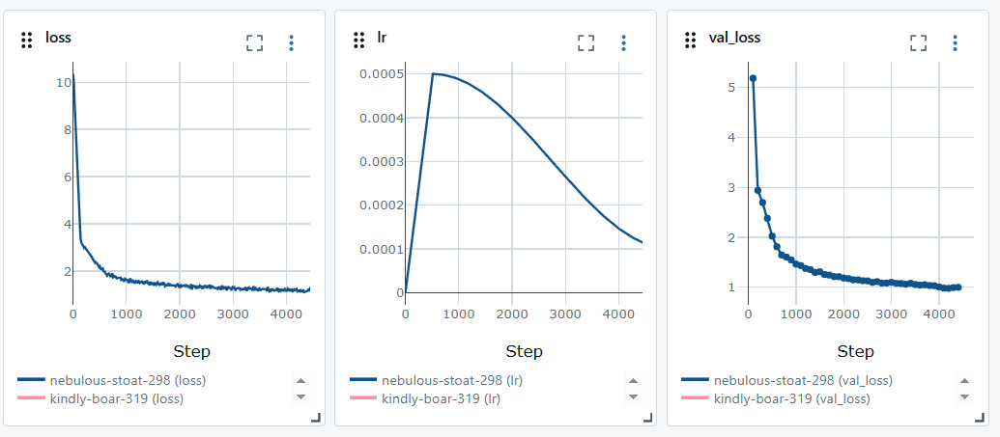

# CS336 作业1 - 从零开始实现Transformer语言模型

[English Version](README_en.md)

本项目参照CS336 作业1要求，从零开始实现了一个基于Transformer架构的语言模型。项目包含完整的模型架构、分词器、训练和评估流程，使用TinyStories数据集进行训练。

## 项目概述

- **目标**：实现一个基础的Transformer语言模型，理解其核心组件和工作原理
- **核心功能**：
  - 基于Transformer架构的语言模型
  - BPE (Byte-Pair Encoding) 分词器
  - 模型训练和评估流程
  - 文本生成功能

## 模型架构

该项目实现了一个标准的Transformer解码器模型，主要特点包括：

- **词汇表大小**：32000
- **上下文长度**：256
- **模型维度**：512
- **层数**：4
- **注意力头数**：16
- **前馈网络维度**：1344
- **位置编码**：RoPE (Rotary Position Embedding)

模型包含以下核心组件：
- 多头自注意力机制
- 前馈神经网络
- 残差连接和层归一化
- 因果注意力掩码（确保模型只能看到过去的token）

## 文件结构

- `basics/`: 源代码目录，包含所有基础代码，功能模块以类的形式实现
  - `transformer.py`: Transformer模型的核心实现
  - `tokenizer.py`: BPE分词器实现
  - `trainer_model.py`: 模型训练流程
  - `trainer_tokenizer.py`: 分词器训练流程
  - `eva_pretrain.py`: 预训练模型评估
  - `nn_utils.py` & `trainer_utils.py`: 工具函数
- `tests/`: 测试代码目录，adapter.py实现了所有功能，但是通过函数的方式
- `scripts/`: 脚本目录
  - `pretrain_model.py`: 预训练模型脚本
  - `train_tokenizer.py`: 训练分词器脚本
  - `eva_pretrain_model.py`: 评估预训练模型脚本
  - `configs/`: 配置文件目录
- `data/`: 数据目录，用于存放TinyStories数据集

## 数据集

本项目使用TinyStories数据集进行训练。TinyStories是一个由简单英语短故事组成的数据集，专为训练小型语言模型而设计。数据集包含：
- 训练集：`TinyStoriesV2-GPT4-train.dat`
- 验证集：`TinyStoriesV2-GPT4-valid.dat`

原始数据集下载链接：
- 训练集: [TinyStoriesV2-GPT4-train.txt](https://huggingface.co/datasets/roneneldan/TinyStories/resolve/main/TinyStoriesV2-GPT4-train.txt)
- 验证集: [TinyStoriesV2-GPT4-valid.txt](https://huggingface.co/datasets/roneneldan/TinyStories/resolve/main/TinyStoriesV2-GPT4-valid.txt)

## 环境设置与运行

### 依赖管理

本项目使用uv进行依赖管理，相比传统的pip和conda，uv提供了更快的包安装和环境管理。

### 运行指南

```bash
# 训练分词器
uv run scripts/train_tokenizer.py

# 预训练模型
uv run scripts/pretrain_model.py

# 评估预训练模型
uv run scripts/eva_pretrain_model.py
```

## 预训练

- **硬件**：Tesla T4 GPU
- **数据集**：TinyStories
- **训练时长**：30分钟
- **训练配置**：
  - 学习率：0.0005
  - 最小学习率：0.0001
  - 权重衰减：0.01
  - 批量大小：32
  - 上下文长度：256
  - 训练步数：5000
  - 梯度裁剪：1.0
  - 学习率调度：warmup (500步) + cosine decay (5000步)

## 训练结果

下图显示了训练过程中的损失曲线：



从损失曲线可以看出，模型在训练过程中损失稳定下降，表明模型学习效果良好。

## 文本生成示例

训练完成后，模型可以用于生成文本。以下是使用模型生成文本的示例代码：

```python
from basics.transformer import Transformer
from basics.tokenizer import Tokenizer

# 加载模型和分词器
model = Transformer.from_pretrained("checkpoints/cs336_lm_TinyStories")
tokenizer = Tokenizer.from_pretrained("checkpoints/cs336_lm_TinyStories")

# 生成文本
prompt = "Once upon a time"
generated_text = model.generate(
    tokenizer.encode(prompt),
    max_new_tokens=100,
    temperature=0.8,
    top_k=40
)
print(tokenizer.decode(generated_text))
```